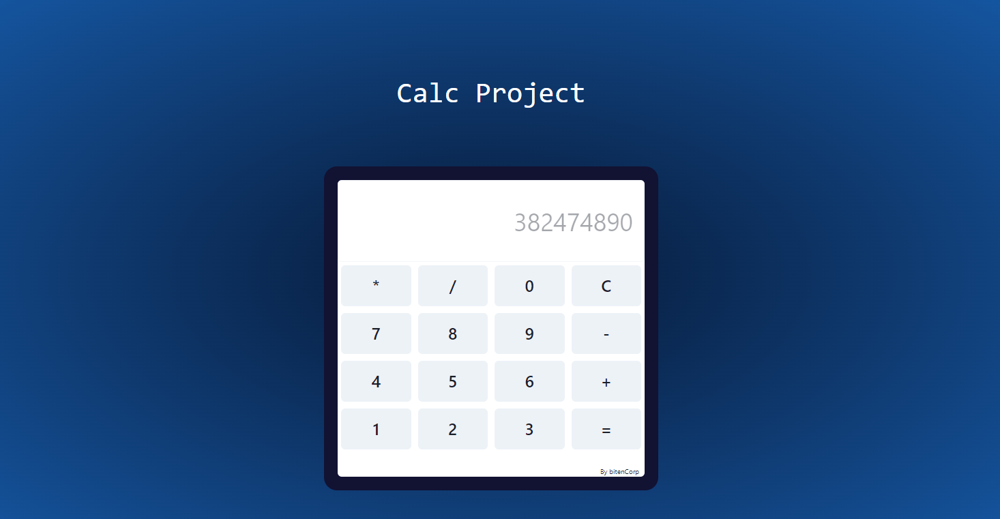

# ProjetoCalc - Formação React Developer DIO

Tecnologias utilizadas:

- React
- TypeScript
- Vite

- Veja funcionando em https://calc-project-nine.vercel.app/

Para rodar o projeto:

- Clone o projeto em https://github.com/EmanuelBitenc/CalcProject.git
- De "yarn" no terminal para baixar as pendencias
- De "yarn dev" para rodar o projeto
